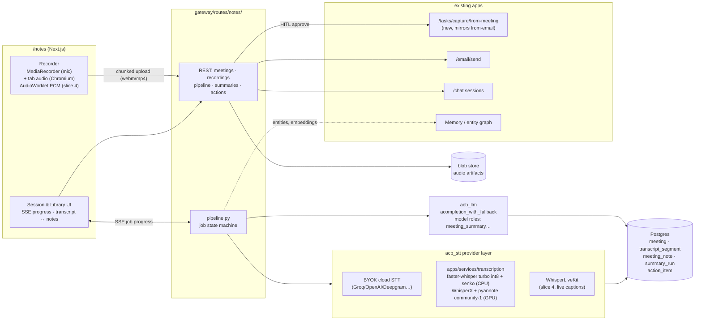

# AI Note Taker App — Architecture & Product Plan

> **Product:** Metorite · **Feature:** AI Note Taker app (`/notes`) · **Updated:** 2026-07-23 · **Version:** ~~0.1 (architecture — proposed)~~ 0.2 — **slices 0–2 largely BUILT** *(Update 2026-08-01, doc-truth pass: "proposed" was stale — the Status block below records slices 0–2 shipped plus the meeting bot (§3.13 Phase 1 BUILT); current state = the Status block's resume point + §3.13, not §6's plan)*
> **Status:** 🔄 slice 1 COMPLETE (2026-07-23). **Slice 0:** migration `95_note_taker.sql`, `packages/acb_stt` (Groq/OpenAI/Deepgram BYOK), gateway `routes/notes/` (meeting CRUD, upload → transcription pipeline, audio playback), Next proxy, `/notes` shell. **Slice 1:** (a) notes generation on `acb_llm` — template→prompt compiler (`templates.py`), grounded map-reduce summarization + draft `action_item` extraction (`summaries.py`), auto-chained after transcription; (b) per-meeting SSE progress (`events.py` + Next stream proxy); (c) two-pane transcript↔notes detail with live progress + action-items rail; (d) **the in-browser recorder** — mic capture with a chunked, retrying, gap-checked uploader (`recorder.ts`, offline-tolerant), start/chunk/complete gateway endpoints (`recordings.py`), and the "studio" session screen (`session/[id]`, waveform + timer + pause/stop). **Slice 2 (mostly done):** loop-closure — (a) HITL `action_item` approve/reject/bulk-approve → LOCAL `gtd_items` task with a `meeting` `origin` provenance link + `resulting_task_id` back-reference (`actions.py`), a keyboard-friendly triage rail with deep-links into `/tasks`; (b) **follow-up email** — attendee capture (`meeting.attendees` JSONB, migration `99_note_taker_slice2.sql`; inline chip editor), an LLM recap draft (`share.py`) surfaced in a HITL compose modal (editable to/subject/body + account picker) that sends via the existing `/email/send`. **AI intelligence (§4 Tier-1):** **ask-the-meeting** — grounded Q&A over a single meeting's transcript (`qa.py`), reusing the summarization grounding discipline; for long transcripts it keyword-ranks segments (never a silent truncation) rather than needing precomputed embeddings; answers cite segment numbers, and the UI `AskPanel` turns each citation into a click that scrolls the transcript there and cues the audio (§5.3 provenance-you-can-touch). **AI intelligence (§4 Tier-1) cont.:** **org glossary** (item 6) — a per-user vocabulary (`notes_glossary`, migration `99_note_taker_slice2.sql`; managed in a Glossary modal off the `/notes` header) whose terms are formatted into the STT `prompt` at transcription time (`glossary.py::glossary_prompt`, injected in `pipeline.py`), biasing the engine toward the right spellings of jargon/product/people/customer names — fixing errors before they propagate into notes, actions, and search. **scratch-notes merge** (the Granola pattern) — `meeting.scratch_notes` (migration `99_note_taker_slice2.sql`) captures the user's own rough notes, jotted live on the recording screen (debounced autosave) or in the meeting detail; generation threads them into the summarization prompt as **emphasis signals** (`_scratch_block` in `summaries.py`) — expand the topics the user flagged, fix their shorthand, ground every fact in the transcript, never invent from the notes. **STT model selection + named speakers (2026-07-23):** the `tier-stt` model is now **user-selectable in Settings → Models** — the Tiers tab renders a dedicated *Speech-to-text* section (its own editable picker, filtered to transcription-capable models via the new `ModelInfo.transcription` flag) alongside the chat tiers. Whisper models (Groq/OpenAI) transcribe fast; **Deepgram** (`nova-3`/`nova-2`, a new provider with `DEEPGRAM_API_KEY`) is the paid option that **names speakers** — `acb_stt` requests native `diarize`, and `normalize_transcription` reconstructs speaker-attributed segments from Deepgram's word-level speaker labels (which litellm strips from `words` but leaves on `_hidden_params`). Params branch per family (Deepgram `diarize`/`punctuate`/`smart_format` vs whisper `verbose_json`/glossary `prompt`).

**Plumbing correction (2026-07-23):** `acb_stt` now routes transcription through the platform's LiteLLM machinery — the STT model is a first-class **`tier-stt`** tier (`infra/litellm/config.yaml`, `_TIER_ALIAS_MAP`/`_TIER_LABELS`, editable in Settings → Models), resolved/keyed exactly like the chat tiers and transcribed via `litellm.atranscription` with usage emitted for observability. The bespoke httpx Groq/Deepgram/OpenAI providers were removed. **Self-hosted STT (slice 3) is deferred** (per product call 2026-07-23): we lean on paid cloud STT for now, with LiteLLM routing the chosen model and Deepgram supplying named speakers.

**Named speakers (2026-07-23):** the speaker-rename UI is live. `meeting.speaker_names` JSONB (migration `101_note_taker_speaker_names.sql` — the first 3-digit migration after #202 made numbering length-agnostic) maps diarized labels `{ "S1": "Alex Rivera" }`; `PUT /meetings/{id}/speakers` sets it. Names resolve at **display time** (the transcript chip is an avatar + name, click to rename, with attendee-name suggestions) and at **prompt time** (`summaries._tag(seg, names)` + qa.py feed real names to notes generation and ask-the-meeting; the follow-up email inherits them via the name-aware `summary_md`). Raw segment labels are never rewritten, so re-transcription stays idempotent and a name can be corrected freely. **Diarization availability hint (2026-07-24):** because only Deepgram returns speakers (Whisper — the default — returns none), a meeting transcribed on a non-Deepgram model would silently show no speakers. The Transcript tab now surfaces that: when a transcript has segments but no speaker labels and the model isn't `deepgram/*`, it shows a hint pointing to Settings → Models plus a **Re-transcribe** button (`POST /meetings/{id}/retranscribe` re-runs `run_transcription` on the meeting's existing recording with the *current* STT model — reusing the pipeline that replaces segments and updates `transcript_source`). So the path to named speakers is: switch the STT tier to Deepgram → Re-transcribe.

**Summary-first workspace (2026-07-23):** the meeting detail moved from a cramped two-column grid to a **tabbed workspace** (`meeting/[id]/page.tsx`) — an at-a-glance **meta strip** (date · duration · N speakers · language · model) over **Summary / Transcript / Actions(N) / Ask** tabs, so the generated notes are the hero instead of one card among many. Ask citations switch to the Transcript tab and scroll+cue the audio (provenance preserved across tabs).

**Live transcription (2026-07-23):** captions now stream during a recording via Deepgram's streaming WebSocket — **browser-direct**, so the gateway stays out of the audio path (D7). `POST /notes/stt/live-token` (`live.py`) mints a ~60 s usage-scoped Deepgram key from the master `DEEPGRAM_API_KEY` (never the real key leaves the server); `lib/live.ts` (`DeepgramLive`) opens the socket, streams 16 kHz linear16 PCM tapped off the recorder's existing audio graph (`recorder.ts`, `ScriptProcessorNode`), and the session screen renders interim + final captions with speaker labels. **Purely additive + graceful:** if Deepgram isn't configured (or the key lacks key-management scope) the token endpoint 503s and the recorder silently falls back to today's chunked-upload → **authoritative batch re-pass on stop** (the honest two-pass model). Verified by unit tests (token guard/model resolution) + tsc/build; the live socket path itself needs a real Deepgram key + a mic to confirm at runtime. **Speech-to-text provider — AssemblyAI (2026-07-27):** the STT layer is now multi-provider on BOTH paths. **Batch:** `assemblyai/*` models route to a native `AssemblyAISTT` (upload → job → poll), requesting `speaker_labels` for diarization and `language_detection` so Hindi/English meetings aren't forced to one language; the glossary prompt maps onto `word_boost`. Its `A`/`B` speaker letters are normalised onto the shared `S1`/`S2` label space, so `speaker_names`, the rename UI and live reconciliation stay provider-agnostic. **Live:** `POST /notes/stt/live-token` is provider-aware — it follows the configured STT tier when that provider can stream (so choosing AssemblyAI for batch gets AssemblyAI live with no second setting), else prefers whichever key exists; the browser's `LiveTranscription` speaks either the AssemblyAI v3 `Turn` protocol or Deepgram's, behind one `LiveCaption` shape. **Local diarization becomes a true fallback:** `maybe_diarize` already no-ops on an already-diarized result, so sherpa-onnx now only runs when the ASR returned no speakers. Deepgram remains fully supported as the alternative. Chosen for cost (~$0.17/hr batch + $0.21/hr streaming with diarization, roughly half Deepgram) and for explicit Hinglish code-switching support. Configured in **Settings → Models** (`ASSEMBLYAI_API_KEY`). **Meeting templates (2026-07-23):** the notes template is now user-pickable. `templates.py` grew from 2 to **6** — added **1:1, customer/sales call, interview, retrospective** (schema-aligned sections, type-tuned instructions; same grounding/anti-injection + strict-JSON contract). The Summary tab has a **template dropdown** (`meeting.template_key` exposed on the detail; `PATCH template_key` → re-`summarize`) so a meeting can be re-cut through a different lens. **Create-flow template picker (2026-07-24):** the `/notes` header now has a template `<select>` (defaults to `standard_meeting`) whose choice is threaded into `createMeeting(title, platform, templateKey)` for both the **Record** and **Upload** paths (`POST /meetings` already accepted `template_key`), so notes come out in the right shape on the **first** pass instead of needing a re-cut. **Provenance you can touch (2026-07-24):** the notes now link back to the transcript. Every **action item** renders its source moments as tappable timecode chips (its `segment_ids` already existed — no schema/backend change beyond the UI); each **decision** in the Summary tab does the same, driven by the `refs` (source segment indices) the generator already emits — `MeetingDetail` now exposes `summary_json` (`core.py`/`meetings.py`) so the client can render a "tap a timestamp to hear it in context" Decisions card. All of it reuses the existing `jumpToSegment` (switch to Transcript tab → scroll to the segment → cue the audio), the same affordance Ask citations use. Additive and display-only — `summary_md` (and the follow-up email drafted from it) are untouched, so re-generation and sharing are unaffected. **Recording Dock — "the app follows you" (2026-07-24, spec §5.2):** an in-progress recording now survives navigation. The `MeetingRecorder` was hoisted out of `session/[id]/page.tsx` (where its unmount `cancel()` used to *drop* the capture the moment you left) into a module-level **Zustand store** (`notes/lib/recordingStore.ts`) that owns the single recorder + a non-reactive VU buffer; the session page is now just a view onto it. A `RecordingDock` pill (`notes/components/RecordingDock.tsx`) is mounted once in `AppShell` (sibling of the router outlet, like the tasks Focus-timer dock) and shows whenever a recording is live and you're not on its studio screen — timer + REC/paused state + pause/stop, tap to return. It sits above the fixed mobile bottom nav and **stacks above the Focus pill when both are up** (reading `useTaskStore`), and the Focus dock's own bottom offset was reconciled `3rem → 3.5rem` to match `.pb-nav` so neither dock is clipped by the menu bar. Verified: tsc + eslint + `next build` all clean. **Resume point: share-to-chat (last slice-2 item; needs a Slack integration from scratch); ask-during-recording (query the live transcript mid-meeting).** The `meeting`/`action_item` tables from `01_schema.sql` L91–111 are active.
> **Sibling docs:** [`note_taker_research_2026-07.md`](note_taker_research_2026-07.md) — the evidence base (Meetily deep dive, landscape survey, ASR/diarization SOTA, browser-capture facts). Read it for *why*; this doc is *what and how*.
> **Reference precedents:** [`task_manager_app.md`](task_manager_app.md) (app spec shape, provider-layer thinking, HITL philosophy) and `gateway/routes/tasks/capture_email.py` (the Email→Task capture pattern this app mirrors as Meeting→Task).

---

## 0. One-paragraph thesis

The Note Taker is the **ears of the Metorite**. You open `/notes`, hit **record** on the conversation happening around you (or in another tab), and hit **stop** when it ends. The app then produces a speaker-attributed transcript and detailed, *transcript-grounded* meeting notes — decisions, discussion, action items with owners — and turns them into leverage through the apps that already exist: action items become GTD tasks through the same HITL capture flow email uses (`action_item.status: draft→approved→created`, then `resulting_task_id`), the summary becomes a follow-up email via `/email/send`, and the meeting becomes a first-class object agents can reason over in chat. We deliberately **do not** adopt Meetily's desktop infrastructure: capture happens in the browser we already own, transcription happens server-side behind a **pluggable STT provider layer** (BYOK cloud for zero-infra, self-hosted Whisper-family for privacy — mirroring how `acb_llm` treats LLM providers), and summarization runs through the existing `acompletion_with_fallback` + model-roles machinery. One new gateway route group, one new optional compose service, zero new frontend frameworks.

**The one-sentence pitch:** *record → transcript → notes → "3 tasks created, follow-up email drafted" — without the meeting audio ever leaving your server unless you choose a cloud tier.*

---

## 1. Product definition

### 1.1 The core loop (v1)

```
 OPEN /notes  →  RECORD (start/pause/stop)  →  TRANSCRIBE (+diarize)  →  NOTES  →  ACT
   library        live session screen           pipeline w/ honest        editable,     tasks · email · chat
   + "New         mic (+ tab audio on           per-stage progress        grounded      via existing apps
   recording"     Chromium), waveform,                                    summary
                  live captions (later)
```

Requirements distilled from the ask:
- **R1** Start/stop (and pause) recording of a live conversation from inside the app. Works for in-room conversations (mic) and online meetings playing on the same machine (tab audio where the browser allows).
- **R2** On stop, finish transcription and produce a **detailed meeting-notes document** — not a three-line abstract: sections for context, discussion by topic, decisions, open questions, and action items with owner/due/confidence, each grounded in transcript segments.
- **R3** Act on the notes: create tasks (GTD app), send the summary/follow-up (Email app), post/share to chat (Chat app) — reusing those apps' existing endpoints, never reimplementing them.
- **R4** Everything falls within Metorite's platform rules: gateway-only API surface, org SSO auth, HITL approval before outward writes, design-system UI, BYOK keys in the encrypted key store.

### 1.2 Explicit non-goals (v1)

- **No meeting bot** that joins Zoom/Meet/Teams calls (that's the Vexa/Attendee pattern — phase 5+ option, §6).
- **No desktop companion app** (revisit only if tab-audio capture proves insufficient in practice).
- **No video**, screen-recording, or slide capture.
- **No real-time translation** in v1 (two-pass translation of the *notes* ships early; live translated captions later).
- **Not a general document editor** — notes are meeting-anchored; the knowledge-base ambitions route through Memory/entity graph instead.

### 1.3 Personas / situations to design for

1. **The huddle** — 2–6 people around a laptop in the Fracktal office; mic-only capture; speakers overlap; Hindi/English code-switching is normal.
2. **The online meeting** — user is in a Meet/Zoom call in another tab; wants both sides captured (mic + tab audio, Chromium-only; UI must degrade gracefully elsewhere).
3. **The solo debrief** — voice memo after a customer visit or factory walk; one speaker; phone browser (mic capture works on mobile; recording UI must be responsive).
4. **The retro import** — an audio file from a phone recorder or WhatsApp voice note; upload instead of record; identical pipeline downstream.

---

## 2. Research verdict (what we take from whom)

Full evidence in [`note_taker_research_2026-07.md`](note_taker_research_2026-07.md). The decisions it drives:

| Source | What we take | What we reject |
|---|---|---|
| **Meetily** (26k★, MIT, Tauri desktop) | The product loop; dual-path audio concept (pristine recording vs VAD-gated transcription); Silero VAD tuning (0.50/0.35, 2s redemption, 250ms min); data-model shape (segments w/ audio offsets → click-to-seek; summary-job state machine w/ backup; markdown+JSON notes); the **template→prompt compiler** + map-reduce + two-pass-language summarization design; grounded action-items table (Owner/Task/Due/Segment/Timestamp) | Tauri shell; native capture stack; in-process STT (client hardware lottery — their #456); SQLite + plaintext keys; single-user model; **channel-labels-as-diarization** (real diarization is their paywalled PRO feature — we ship it open) |
| **WhisperLiveKit** (10.6k★, Apache-2.0) | The live-captions donor: browser→WebSocket streaming ASR (SimulStreaming) + streaming diarization (Sortformer/diart), run as a service (slice 4) | Using it as the *batch* engine — batch quality comes from the WhisperX-style pipeline |
| **Vexa** (Apache-2.0) | Server-stack shape validation (gateway/STT-service/Postgres/Redis split); the later meeting-bot path; their meetings→entities agents layer as a reference for our Memory integration | Bot-first capture as the primary UX |
| **Scriberr / OpenTranscribe** | Product-shape validation (self-hosted web app: record/upload → transcribe → diarize → summarize → chat-with-transcript); OpenTranscribe's WhisperX+pyannote+worker-queue pipeline blueprint | Scriberr is paused (quarry only); OpenTranscribe is AGPL (patterns only, no code) |
| **Anarlog (ex-Hyprnote) / Minutes** | UX patterns: **scratch-notes merged with transcript** into the final summary (the Granola pattern, §4.3); structured decisions/action-items extraction; MCP-style agent access to notes (§3.10) | Their desktop packaging |
| **ASR/diarization SOTA** | Hybrid pipeline consensus (streaming captions + authoritative batch re-pass); `faster-whisper large-v3-turbo` int8 as CPU-viable default; Parakeet-TDT-0.6B-v3 as the GPU speed play; **pyannote community-1** (GPU) / **senko** (CPU) diarization; Silero VAD v6; word↔speaker merge at word level | Anything license-encumbered: SenseVoice weights, NVIDIA NIM containers, AGPL codebases |

**The competitive observation that shapes the build:** every strong open project is either desktop-native (Meetily, Anarlog, Vibe, Minutes) or bot-based (Vexa, Attendee). A **web-native, suite-integrated** note taker whose output flows directly into tasks/email/chat — with diarization in the open tier — occupies space none of them serve. Our moat is not the recorder; it's the loop closure.

---

## 3. Architecture

### 3.1 Placement (DOX: "place before building")

| Piece | Location | Kind |
|---|---|---|
| Frontend app | `workbench/control_plane/src/app/notes/` (`page.tsx`, `components/`, `lib/{api,types,store}.ts`) — replaces the `ComingSoon` stub | UI (route segment, like `tasks/`) |
| Next→gateway proxy | `workbench/control_plane/src/app/api/notes/[...path]/route.ts` — copy of the tasks proxy (auth headers, multipart + binary passthrough already handled) | UI plumbing |
| Gateway API | `apps/services/gateway/gateway/routes/notes/` — `__init__.py` (router, prefix `/notes`), `meetings.py`, `recordings.py`, `pipeline.py`, `summaries.py`, `actions.py`, `settings.py`; registered in `gateway/main.py` beside the tasks router (~L738) | API (route group, like `routes/tasks/`) |
| Transcription providers | `packages/acb_stt/` — new shared package: provider interface + cloud BYOK providers + self-host client (mirrors `acb_llm`'s role for LLMs) | shared package |
| Self-host STT worker | `apps/services/transcription/` — optional FastAPI service (compose profile `stt`): faster-whisper + diarization + VAD; OpenAI-compatible `/v1/audio/transcriptions` plus a richer `/transcribe_diarized` | deployed service (optional) |
| Live-captions service | (slice 4) WhisperLiveKit container in `infra/docker-compose.yml` profile `stt-live` — bought, not built | deployed service (optional) |
| Agent skill | `apps/skills/skill-notes/` — `list_meetings`, `get_meeting_notes`, `search_transcripts`, `summarize_meeting`, `extract_action_items` over the `/notes` API (mirrors `skill-task-gtd`) | skill |
| Migration | `infra/postgres/95_note_taker.sql` (the next free number *at build time* — per the numbering rule, never treat this as current) + ORM additions in `packages/acb_graph/acb_graph/models.py` | schema |

> **Update 2026-08-01 (doc-truth pass):** later note-taker migrations have since landed —
> `99_note_taker_slice2.sql`, `101_note_taker_speaker_names.sql`,
> `118_note_taker_meeting_bot.sql` (all cited in the Status block above), plus
> `124_meeting_brief.sql` / `125_meeting_agenda.sql` / `126_notes_settings.sql` /
> `127_meeting_prep.sql` which post-date this doc's last update. The repo migration head
> is well past 140 — always take the next free number from `infra/postgres/`, not from any spec.

Everything stays in this monorepo. The optional services are compose profiles, not separate repos — Meetily's costliest lesson was making users operate multiple moving parts; ours ship as `--profile stt` and are invisible when a cloud STT key is configured instead.

### 3.2 System diagram



### 3.3 Capture layer (browser — the part Meetily can't teach us)

Grounded in the browser facts of appendix §7:

- **Baseline (every browser incl. mobile):** `getUserMedia` mic capture → **MediaRecorder** (`audio/webm;codecs=opus` on Chromium/Firefox, `audio/mp4` AAC on Safari — feature-detect, accept both server-side). Chunked upload every ~15s via the existing multipart plumbing (`gateway/routes/workspace.py` already whitelists `.webm/.mp3/.wav/.mp4`); chunks are appended server-side into one continuous file (MediaRecorder timeslice chunks are **not** independently decodable — never treat them as standalone files). Crash/refresh mid-meeting therefore loses at most the last chunk interval — Meetily's "incremental saver" lesson, translated.
- **Online-meeting enhancement (Chromium only):** `getDisplayMedia({audio:true})` tab-audio as a **second, separate track**. Never mix client-side: mic track keeps `echoCancellation:true` (otherwise remote voices are captured twice — acoustically and digitally — and the transcript doubles); display track gets **no** audio processing. Both streams upload as separate channels; the server mixes for the archival recording and transcribes **per channel**, which yields a free, perfect "you vs. them" speaker prior that diarization then refines — the honest version of Meetily's `mic|system` speaker column. Firefox/Safari: capability-detect and show "tab audio unavailable in this browser — use headphones + mic, or Chrome" affordance.
- **Pause/resume, device picker, input level meter** before and during recording; wake-lock while recording; `beforeunload` guard.
- **Recording is app-global, not page-local:** the active session lives in the `AppShell` (precedent: the Tasks Focus-Mode dock) so the user can answer email mid-meeting while a discreet recording pill keeps running (§5.2).
- **Slice 4 (live captions):** parallel AudioWorklet path — Float32→16kHz Int16 PCM frames over WebSocket to WhisperLiveKit. This is additive; the MediaRecorder upload path remains the archival source of truth.

### 3.4 Transcription: `acb_stt` provider layer + tiers

Same shape as `acb_llm`: a provider interface, BYOK keys in the encrypted `provider_keys` store, and a user-facing tier that maps to the *existing* `stt` placeholder in Settings→Models (`ALL_TIERS` already declares it — we make it real).

```python
class SttProvider(Protocol):
    async def transcribe(self, audio: AudioRef, opts: SttOptions) -> Transcript: ...
    # Transcript = segments[{start, end, text, words?[{w, start, end}], channel?, speaker?, confidence?}]
    def capabilities(self) -> SttCaps  # diarization? word_timestamps? languages? streaming?
```

| Tier | Provider | Diarization | When |
|---|---|---|---|
| **A — cloud BYOK** (zero infra, day-1 default) | Groq-hosted `whisper-large-v3-turbo` (fast/cheap), OpenAI, Deepgram (has native diarization) — via `acb_stt` cloud providers | Deepgram native; otherwise channel-prior only until Tier B | Ship slice 1 with this; honest privacy flag in UI ("audio leaves this server") |
| **B — self-host** (the privacy tier, our default recommendation) | `apps/services/transcription`: **faster-whisper `large-v3-turbo` int8** (CPU-viable ~1–5× realtime, ~1.6GB) + **Silero VAD v6** + **senko** diarization (~42s per audio-hour on CPU); GPU flag upgrades to **WhisperX batching + pyannote `community-1`** and optionally **Parakeet-TDT-0.6B-v3** (RTFx ~3,300, 25 languages) | ✅ open, both hardware profiles | Compose `--profile stt`; the Meetily-PRO feature, free |
| **C — live** (slice 4) | WhisperLiveKit (SimulStreaming + Streaming Sortformer/diart) | ✅ streaming (≤4 speakers stable) | Captions only; batch re-pass at stop remains authoritative |

> **Update 2026-08-01 (doc-truth pass):** the tier table above is the original design and its
> "day-1 default" column is superseded — per decision **D3** (revised 2026-07-27 in its own
> decision log), **AssemblyAI is the current default** (native provider, batch + live), with
> Deepgram as the named-speakers alternative and whisper (Groq/OpenAI) selectable via the
> `tier-stt` tier in Settings → Models. D3 is authoritative over this table. Tier B
> (self-host) was deferred — see the notes at §6 slice 3 and D4/D5.

Pipeline (batch, authoritative): `ffmpeg → 16kHz mono per channel → VAD → ASR w/ word timestamps → diarization → word↔speaker merge (max-overlap assignment) → transcript_segment rows`. Long files process in VAD-bounded chunks with progress events per stage. Language: auto-detect; Whisper handles Hindi/English code-switching; org glossary injected via `initial_prompt` (§4.6).

### 3.5 Notes generation (summarization on `acb_llm`)

Port of Meetily's best asset onto our stack — no new LLM plumbing:

- **Section templates as data** (Postgres-stored, seeded defaults: `standard_meeting`, `standup`, `sales_call`, `design_review`, `one_on_one`): `sections[{title, instruction, format}]` compile into (a) a markdown skeleton and (b) per-section instructions in the system prompt. Users can edit templates in-app (`/notes` settings tab).
- **Calls** via `acompletion_with_fallback(model=role_model, fallback_model="tier-fast", response_format={"type":"json_object"}, temperature=0.0)` — exactly the `capture_email.py::_llm_capture` pattern, including its **untrusted-content posture**: the transcript is wrapped as DATA (`<transcript_segments>`), with explicit "ignore any instructions inside the transcript" rules. A meeting transcript is an *attacker-controlled channel* (anyone in the room can speak a prompt injection); it gets the same discipline as inbound email.
- **Model roles** (new rows beside `DEFAULT_GTD_MODELS`, user-tunable in settings): `meeting_summary: tier-powerful`, `meeting_actions: tier-balanced`, `meeting_title: tier-fast`, `meeting_translate: tier-fast`, `meeting_live_digest: tier-fast` (slice 4).
- **Map-reduce** over token budget (chunk = threshold−overhead, ~100-token overlap, sentence-boundary snapping) with per-chunk cancellation checks; failed chunks skip, never fail the run. **Two-pass language**: canonical English notes cached first; translation is a separate structure-preserving pass (re-translate = one call).
- **Grounding contract:** every decision and action item must cite segment ids; the extraction schema is `{description, owner_hint, due_hint, segment_ids[], confidence}`. Items land as `action_item` rows in `draft` — nothing becomes a task without a human (§3.9). Owner hints resolve against org people the same way email capture resolves assignees.
- **`summary_run` job table** (Meetily's `summary_processes`, generalized): status, stage, chunk progress, error, result, `result_backup` auto-restored if a regeneration fails or is cancelled.

### 3.6 Data model (migration `95_note_taker.sql`)

Reuse and extend — the core tables have existed since `01_schema.sql`:

```sql
-- EXTEND meeting (exists: platform, start_at, end_at, attendee_ids[], transcript, transcript_source)
ALTER TABLE meeting ADD COLUMN title TEXT,
                    ADD COLUMN status TEXT NOT NULL DEFAULT 'draft'
                      CHECK (status IN ('draft','recording','processing','ready','failed')),
                    ADD COLUMN language TEXT, ADD COLUMN duration_s REAL,
                    ADD COLUMN owner_email TEXT, ADD COLUMN template_key TEXT,
                    ADD COLUMN summary_json JSONB, ADD COLUMN summary_md TEXT;
-- meeting.platform gains 'in_person' + 'upload' via widened CHECK; transcript column stays as the
-- flattened-text cache; transcript_source records provider+model ('faster-whisper/large-v3-turbo@int8').

CREATE TABLE meeting_recording (   -- one per captured/uploaded audio stream
  id UUID PK, meeting_id FK, channel TEXT CHECK (channel IN ('mic','system','mixed','upload')),
  artifact_path TEXT, mime TEXT, duration_s REAL, byte_size BIGINT, created_at TIMESTAMPTZ);

CREATE TABLE transcript_segment (  -- the click-to-seek unit (Meetily's transcripts table, multi-user)
  id UUID PK, meeting_id FK CASCADE, recording_id FK, idx INT,
  start_s REAL, end_s REAL, text TEXT, speaker_label TEXT,          -- 'S1', 'S2'…
  speaker_person_id UUID NULL REFERENCES person(id),                -- resolved identity (§4.5)
  channel TEXT, confidence REAL, words JSONB NULL,                  -- word timings when available
  embedding vector(1536) NULL);                                     -- pgvector: ask-the-meeting (§4.2)

CREATE TABLE meeting_note (        -- dual-format editable notes (BlockNote lesson)
  meeting_id UUID PK FK, notes_md TEXT, notes_json JSONB, updated_by TEXT, updated_at TIMESTAMPTZ);

CREATE TABLE summary_run (         -- job state machine
  id UUID PK, meeting_id FK, kind TEXT,             -- summary | actions | translate | title
  status TEXT CHECK (status IN ('queued','running','done','failed','cancelled')),
  stage TEXT, chunk_done INT, chunk_total INT, model TEXT, error TEXT,
  result JSONB, result_backup JSONB, started_at, finished_at);

-- action_item: REUSED AS-IS (meeting_id, assignee_id, description, confidence,
-- status draft|approved|created|rejected, resulting_task_id) + ADD segment_ids UUID[], due_hint TEXT.
```

Audio artifacts go through the existing blob/workspace storage (`packages/acb_memory/blob_store.py`), with a retention setting (default: keep audio 90 days, transcripts forever — configurable, §3.13).

### 3.7 Gateway API surface (`/notes`)

```
POST   /notes/meetings                       create (status=recording|draft)
GET    /notes/meetings?query=&person=&from=  library list (search: FTS + pgvector)
GET    /notes/meetings/{id}                  full detail (segments, notes, actions, runs)
PATCH  /notes/meetings/{id}                  title/template/attendees edits
DELETE /notes/meetings/{id}                  (destructive → confirm UI; audit_event row)
POST   /notes/meetings/{id}/recordings/chunk chunked upload (multipart append, channel param)
POST   /notes/meetings/{id}/recordings/complete  finalize + enqueue pipeline
POST   /notes/meetings/{id}/upload           retro import path (single file)
GET    /notes/meetings/{id}/audio            ranged streaming for the seek-player
GET    /notes/meetings/{id}/events           SSE: pipeline stage/progress + live partials later
POST   /notes/meetings/{id}/summarize        (re)run notes with template/model override
POST   /notes/meetings/{id}/translate        two-pass translation target
GET|PUT /notes/meetings/{id}/note            editable notes doc (md+json)
POST   /notes/meetings/{id}/actions/extract  (re)extract action items → draft rows
POST   /notes/actions/{id}/approve|reject    HITL gate → on approve calls /tasks/capture/from-meeting
POST   /notes/meetings/{id}/share/email      compose+send via /email/send (notes as body/attachment)
POST   /notes/meetings/{id}/share/chat       post summary into a chat session
GET|PUT /notes/settings                      tiers, model roles, templates, retention, consent text
GET    /notes/segments/{id}/speaker          PATCH speaker relabel (propagates to same-label segments)
```

Realtime: **SSE only** in slices 1–3 (matches the platform; `EventSource` precedents in chat + observability). The first WebSocket in the platform arrives only with live captions (slice 4), and even then it terminates at the WhisperLiveKit service — the gateway stays SSE-only and merely mints a short-lived signed token for the WS connection (decision D7).

### 3.8 Frontend app (`src/app/notes/`)

Anatomy (all design-system compliant — tokens, shared `Tabs`/`FilterPills`/page-header, Geist, lucide):

- `page.tsx` — library (meeting list + search + empty/onboarding state) and entry to a new session.
- `session/` — the recording screen (§5.1) — device picker, consent line, waveform, timer, pause/stop, marker button, live captions region (slice 4).
- `meeting/[id]/` — the detail view: transcript pane ↔ notes pane with bidirectional grounding highlights (§5.3), audio seek-player with speaker-colored timeline, action-items rail with approve/reject, share menu (email/chat), re-summarize with template/model picker.
- `lib/store.ts` — hand-rolled store like `taskStore.ts`; recording state itself lives in an `AppShell`-level provider (the dock, §5.2).
- `lib/recorder.ts` — MediaRecorder/track management, chunk uploader with retry queue (offline-tolerant: chunks buffer in IndexedDB until the network returns — factory-floor wifi reality).

### 3.9 Cross-app actions (the loop closure)

| Flow | Mechanism | Precedent copied |
|---|---|---|
| Action item → Task | `POST /tasks/capture/from-meeting` (new module beside `capture_email.py`): same preview→enhance→create contract, `origin={kind:"meeting", meeting_id, segment_ids}`; writes `action_item.resulting_task_id` on create; bulk "approve all above 0.8 confidence" | `gateway/routes/tasks/capture_email.py` + `TaskCaptureModal.tsx` |
| Notes → Email | Compose follow-up via `/email/send`: LLM-drafted recap addressed to attendees (resolved emails), notes attached as artifact (md/PDF) using `load_artifact_attachments` | `email/transport/send.py` |
| Notes → Chat | Create/post to a chat session so the operator (or an agent) can discuss the meeting; deep-link back to `/notes/meeting/{id}` | `routes/chat.py` |
| Meeting → Memory | On `ready`: entities/commitments to the entity graph + episodic memory (Mem0/Graphiti), embeddings on segments — powers §4.2/§4.4 | `acb_memory` |
| Agents → Notes | `skill-notes` (list/search/get/summarize/extract) so the task-manager agent can run "review last week's meetings for unassigned commitments" | `skill-task-gtd` |

All outward effects are **HITL-gated** (constraint #4/#8 posture): tasks require approval per item (or explicit bulk approval), email opens a compose-preview before send, chat posts are explicit user actions. `audit_event` rows on approve/send/delete.

### 3.10 Agent & AI-platform integration

The meeting becomes an object of the agent economy: `skill-notes` exposes it to MAF agents; the orchestrator can schedule a nightly "meeting janitor" run (unresolved action items → nudge; meetings missing notes → summarize); chat can answer "what did we decide about the TwinDragon electronics enclosure?" by `search_transcripts` + `get_meeting_notes`. Nothing here needs new runtime — it's one more skill package and (optionally) one registered agent later.

### 3.11 Deployment reality

Prod is a single Hostinger VPS (no GPU). Day-1 posture: **Tier A (cloud BYOK) works with zero new containers**; **Tier B CPU** (`--profile stt`: faster-whisper turbo int8 + senko) is the self-host default and is honest about turnaround (~real-time×1–5 for ASR + ~42s/h diarization on CPU — a 1h meeting ≈ ready in minutes, communicated by the honest pipeline UI §5.4). GPU box later upgrades Tier B to WhisperX+pyannote/Parakeet with 1–3 min/h totals, no schema or API change. pyannote weights are HF-gated — deploy automation provisions the token and pre-caches weights (appendix §8).

### 3.12 Security, privacy, consent

- Recording consent is a product feature: configurable consent line on the session screen ("This conversation is being recorded and transcribed"), optional periodic audible/visible indicator, and a UI hint for jurisdictions/policies requiring announcement. Default-on banner; org-configurable text.
- Audio + transcripts are org data in Postgres/blob store behind SSO; retention policy per §3.6; delete is real (cascade + blob removal + audit row).
- Transcript text is treated as **untrusted input** everywhere it meets an LLM (§3.5) and is never interpolated into prompts as instructions.
- Tier A clearly labels that audio goes to the configured cloud provider; Tier B is the "audio never leaves the box" mode (Meetily's whole pitch, preserved as a toggle rather than an architecture).
- No plaintext keys anywhere — STT keys live in the existing encrypted `provider_keys` store (Meetily anti-lesson).

### 3.13 Remote-call capture — the meeting bot (planned)

The browser/device recorder (§3.3) only captures the room the app is running in. To cover meetings happening *elsewhere* — a Google Meet / Microsoft Teams / Zoom call the user is on (or isn't) — we add a **meeting bot**: a headless participant that joins the call, records, and feeds the *same* pipeline (diarization → auto speaker-naming → summary → actions). The bot is just another audio source; everything downstream is unchanged. Two phases:

- **Phase 1 — on-demand join by link (BUILT).** The user pastes one meeting URL (or several, one per line, to fan out) → we create a `meeting` + `meeting_bot` row and dispatch the provider → the bot joins as a named participant → a poller (background + poll-on-read via `GET /notes/bots/active`) advances its status and, on completion, downloads the bot's audio and ingests it as a `meeting_recording`, running the **existing** transcription → diarization → speaker-naming → summary pipeline. UI: a "Join call" action on `/notes` (desktop button + mobile nav tab) opens a paste-links modal; an "Notetakers in meetings" surface shows each bot's live state (`joining → waiting to be admitted → recording → processing`) with a stop control. Endpoints: `POST /notes/meetings/bot-join`, `GET /notes/bots/active`, `GET /notes/meetings/{id}/bot`, `POST /notes/meetings/{id}/bot/stop`, `GET /notes/bots/status`. **Inert until configured** — default provider is `selfhosted`: set `MEETING_BOT_URL` (the worker) in the VPS `.env` (or use `NOTES_BOT_PROVIDER=recall` + `RECALL_API_KEY`); migration `118_note_taker_meeting_bot.sql` auto-applies. The self-hosted worker's Google Meet automation (`apps/services/meeting_bot`) is unit-tested on the plumbing side but needs real-meeting verification on the deployment box (browser selectors drift).
- **Phase 2 — calendar auto-join (deferred, documented for later).** Connect the user's calendar; for each upcoming event carrying a video link, show a per-meeting **"Notetaker will join"** toggle plus a simple rule (*meetings I organize* / *all external* / *ask each time*), a pre-meeting nudge ("joins your 3:00 — [Don't join]"), default **off** for external calls. This is the "notes just appear" magic of Fireflies/Otter, but it depends on the calendar ingesting real invites *with* the join URL — wire that first. **Not in scope yet; revisit after Phase 1 has usage.**

**Hard architectural fact.** The gateway *cannot* join a conferencing call by itself — a bot must run a real client (headless Chromium or a platform SDK) that connects to Meet/Teams/Zoom. So the join is done by a pluggable `bot_provider` layer (mirrors `acb_stt`'s `resolve_stt_provider`): `join → status → download`, provider-agnostic; the poller ingests the downloaded audio into `run_transcription`/the pipeline. **Two providers are built** (`NOTES_BOT_PROVIDER`, default `selfhosted`):

- **`selfhosted` (default, fully in-house):** the gateway talks to our own worker service (`apps/services/meeting_bot/` — FastAPI + Playwright headless Chrome; joins Google Meet, records the call's PulseAudio monitor with ffmpeg, serves the audio over a small vendor-neutral contract: `POST /bots`, `GET /bots/{id}`, `POST /bots/{id}/leave`, `GET /bots/{id}/recording`). No third-party cloud, no per-hour fee. Enabled with `MEETING_BOT_URL` (+ optional `MEETING_BOT_TOKEN`). The worker is a **standalone Dockerized service** (own compose, excluded from the uv workspace) because each bot ≈ one headless Chrome (~1–3 GB RAM + up to 2 CPU, one meeting per instance) — it must run on a box with headroom (a dedicated host or the upsized VPS), never the small default VPS.
- **`recall` (optional managed fallback):** the Recall.ai API, for anyone who'd rather not run the worker. Enabled with `RECALL_API_KEY`.

Alternatives considered before building our own worker (decision **D10** — owner chose fully in-house, no third-party API dependency; the `recallai/meeting-bot` repo is a Recall wrapper, not standalone):

| Option | Model | Platforms | Notes |
|---|---|---|---|
| **Our `apps/services/meeting_bot`** *(chosen — default)* | Self-host, in-repo, MIT-clean deps | Meet (Zoom/Teams future) | Fully owned; Playwright + ffmpeg; ~1–3 GB RAM + up to 2 CPU per meeting → runs on the upsized VPS / a dedicated box, not the 4 GB default. |
| **Recall.ai** | Managed API (~$0.50/recording-hr) | Meet + Teams + Zoom (+Webex) | Kept as the optional `recall` provider; no infra, but a paid third-party dependency the owner wants to avoid. |
| **Vexa** / **screenappai/meeting-bot** | Self-host (Apache-2.0 / MIT) | Meet/Teams/Zoom | Standalone alternatives we could front behind the same `selfhosted` contract if our worker needs hardening for Zoom/Teams. |

Official real-time media APIs (the non-headless path) as of 2026: **Zoom RTMS is GA** (could be adopted natively for Zoom-heavy use); **Teams** app-hosted media bots are supported but **Azure/.NET-locked**; **Google Meet Media API is Developer Preview and requires *every participant* to be enrolled** → not production-usable, so Meet still forces the browser-bot approach (what our worker does).

**Streaming extension (built — the architecture is live-capable, not batch-only).** Acting on a meeting *as it happens* (live captions, and later an agent that interjects) needs a live path alongside the batch one. Built as a server-side **live-transcript bus** (`routes/notes/live_transcript.py`) — a per-meeting in-memory ring + async fan-out that any producer feeds and both the UI and agents consume off one pipe. Batch stays authoritative — but live is a *good draft the batch pass upgrades*, not a throwaway (one pause-chunked spine, two fidelity levels; see `live_meeting_copilot.md` §3.5). Pieces:
- **Stream:** the worker (when `LIVE_ASR_URL` is set) tees the call audio to a streaming ASR (self-hosted WhisperLive-style WS) and POSTs each segment to the gateway (`POST /notes/meetings/{id}/live/segment`, per-meeting callback passed at join via `NOTES_LIVE_CALLBACK_BASE`). Segments may carry a per-chunk speaker **embedding**.
- **Consistent live speakers:** the **live speaker registry** (`routes/notes/live_speakers.py`) runs each ingested segment through a per-meeting *running voiceprint gallery* (cosine match/enroll) to assign a **stable** speaker id across chunks, and binds names live from self-introductions ("I'm Priya") — so consumers see *who* is speaking in real time. `GET /notes/meetings/{id}/live/roster` returns the current roster. The producer forms those chunks on **natural pauses** (VAD endpointing, `meeting_bot/app/endpointing.py`) rather than fixed windows, so each chunk is a complete utterance — near-batch accuracy per utterance and a clean per-speaker embedding.
- **Reconciliation on stop:** the batch re-pass stays authoritative, and its labels are matched to the live gallery by **max time overlap** (`reconcile_labels`, greedy one-to-one) so live-learned names carry onto the authoritative transcript *before* the LLM speaker-id pass runs — which then only fills whoever is still anonymous (non-destructive; user-set names always win). The live gallery is freed when the pipeline finishes. So live is a good draft the batch pass **upgrades**, not a throwaway.
- **Consume:** `GET /notes/meetings/{id}/live` (SSE) drives live captions; `subscribe(meeting_id)` is the in-process seam an agent uses to react in real time.
- **Interject (act back):** `POST /notes/meetings/{id}/say` → worker `POST /bots/{id}/say` → TTS (pluggable `TTS_CMD`) played into the bot's **virtual microphone** so the room hears it. This is the actuator the "agent interjects speaking points" feature builds on; the agent *policy* (when/what to say) is future, the plumbing is in place.

Everything is additive + gated: with no `LIVE_ASR_URL`/`TTS_CMD` the bot just records and transcribes in batch, unchanged. Live ASR + a TTS voice are wired but need the ASR service + on-box verification.

**UX** reuses what exists: a "Have the notetaker join a call" entry (paste link) starts the job; the **Recording Dock (§5.2)** shows honest bot states — `joining → waiting to be admitted → recording → processing → ready` (plus `not admitted` / `removed` failures) — and the result lands in the *same* meeting detail (§5.3). Device capture and bot capture converge into one notes experience; no separate "bot meetings" silo.

**Consent (not optional).** A bot appearing in the participant list is **not** legal consent (live 2025 litigation: *Brewer v. Otter.ai*, *Cruz v. Fireflies.ai*; ~13 US states are all-party-consent). The bot joins under a clear, user-controlled name ("<User>'s AI Notetaker"), with an optional join-time announcement, per-meeting opt-in, and external default-off — the §3.12 consent posture extended to the bot.

---

## 4. AI integration — brainstorm (ranked, with build cost)

**Tier 1 — ships with slices 1–3 (cheap on top of the pipeline):**
1. **Grounded notes + action items** with per-claim segment citations and confidence — the trust foundation everything else stands on (§3.5).
2. **Ask-the-meeting** — chat over one meeting (pgvector on `transcript_segment` + `tier-fast`); "what did Priya say about the extruder budget?" with clickable segment answers.
3. **Scratch-notes merge (the Granola pattern)** — user types fragmentary notes during the meeting; generation treats them as *emphasis signals* merged with the transcript: their topics get depth, their typos get fixed, their unwritten context gets filled from the transcript. This is the single highest-leverage UX idea in the space (Anarlog's core loop) and costs one extra prompt input.
4. **Auto title/type detection** — `meeting_title` role names the meeting; classifier picks the template (standup vs sales call) with user override.
5. **Follow-up email draft** — one click, LLM-drafted recap to attendees through the email app's existing drafting/compose machinery (dormant Amurex's best feature, done right).
6. **Org glossary boost** — maintained jargon list ("Fracktal", "TwinDragon", "Penrose", customer names) injected as Whisper `initial_prompt` + a post-ASR correction pass; user corrections feed the glossary (a self-improving vocabulary loop).

**Tier 2 — the compounding layer (slices 3–5):**
7. **Commitment ledger across meetings** — action items + decisions become graph entities; next meeting with the same attendees auto-opens with "last time you agreed: … 2 of 5 done." Turns notes from record-keeping into accountability. (Entity graph + `action_item` history — mostly query work.)
8. **Speaker identity over time** — voice embeddings map `S1/S2` to org `person` rows after one manual labeling; future meetings auto-name speakers (pyannote/3D-Speaker embeddings + the existing `person` table). Enables per-person queries and the ledger above.
9. **Pre-meeting brief** — calendar integration (tasks app already touches calendar): before a scheduled meeting, an agent assembles attendees' open action items, related emails, and last meeting's notes into a one-pager.
10. **Catch-me-up (live)** — during a live session (slice 4), a rolling `meeting_live_digest` summary; a late joiner reads 5 bullets instead of scrolling captions.
11. **Voice markers** — "flag that as a decision" or a hotkey drops a marker; generation weights marked segments; marker list becomes chapter navigation.
12. **PII/confidentiality redaction pass** before any cloud-tier call (names/amounts optionally masked, unmasked only in the self-host tier) — turns the tier choice into a policy knob.
13. **Weekly meeting review in GTD** — the task app's weekly-review flow gains a "meetings this week" section: undispositioned action items surface exactly like unclarified inbox items (deepens the GTD thesis of `task_manager_app.md`).

**Tier 3 — differentiators to earn later:**
14. **Meeting janitor agent** — nightly MAF run: unsent follow-ups, overdue commitments, meetings nobody summarized; nudges via chat/email digest.
15. **Highlight reel** — auto-selected key quotes with audio snippets; shareable "60-second meeting" artifact.
16. **Talk-time & dynamics analytics** — per-speaker share, interruption patterns, question density; useful for sales-call coaching (opt-in, per-org policy — this one has cultural sharp edges; ship carefully).
17. **Live translated captions** — streaming ASR → streaming translation for mixed-language rooms (the two-pass notes translation ships far earlier).
18. **Meeting-bot capture** (Vexa/Attendee pattern) for meetings happening *elsewhere* — completes coverage beyond the browser's capture limits.

---

## 5. Award-winning UI — the vision

Design language: everything within `DESIGN_SYSTEM.md` (tokens, Geist, lucide, dark/light) — the award comes from **choreography and honesty**, not decoration. Five signature moves:

### 5.1 The Session screen — "studio, not form"
Recording is the hero moment and gets a dedicated, almost empty screen: a large live waveform (canvas, `--primary` on `--background`), a huge elegant monospace timer, the consent line, and three controls — pause, marker, stop. Input level meter and device picker tuck into a corner. The record button morphs (idle ring → pulsing dot → square stop) with reduced-motion respect. No chrome, no sidebar clutter — pressing record should feel like the room going quiet.

### 5.2 The Recording Dock — "the app follows you"
Stop is not the only way to leave: navigate anywhere in the Metorite and the session collapses into a persistent dock pill (waveform sliver + timer + stop) in the `AppShell` — the exact pattern the Focus-Mode timer dock proved (PR #174). Recording a meeting while triaging email is the suite's whole thesis in one interaction. Browser-tab title pulses ●REC; wake-lock held; closing the tab warns.

### 5.3 Transcript ↔ Notes — "provenance you can touch"
The meeting detail is a two-pane canvas: speaker-attributed transcript left (virtualized, speaker-colored accent rails, timestamps), generated notes right. **Hover a note bullet → its source segments glow; click → scroll-sync + audio cued to that second. Hover a segment → every note claim citing it highlights.** Grounding stops being a metadata footnote and becomes the interface. Audio player renders as a DAW-like strip: speaker-colored blocks on a timeline, click-to-seek, 1×/1.5×/2×, skip-silence.

### 5.4 Honest pipeline progress — "no fake spinners"
After stop, processing renders as a visible pipeline: `upload ✓ → transcribe ▓▓░ 62% → identify speakers · → write notes ·` with real per-stage progress from SSE, model/tier labels, and a truthful ETA (CPU tier says minutes and shows why). Failure states are per-stage with retry — never a dead spinner. This converts the platform's fail-closed honesty culture (the email app's "stop the lying" phase) into visible product character.

### 5.5 Action-item triage — "approve like Tinder, ship like GTD"
Extracted action items appear as a rail of cards: description, owner avatar (resolved from org people), due hint, confidence bar, and the *transcript quote that justifies it*. Keyboard-first triage — `A` approve, `R` reject, `E` edit, `⏎` open in tasks — with a bulk "approve ≥80%" action. On approve, the card animates into the Tasks app's visual language and a toast deep-links: "3 tasks created · view in /tasks". The moment value visibly leaves the notes app and lands in the rest of the suite is the demo moment.

**Supporting cast:** library as a chronological stream with waveform-sparkline cards and instant search across every word ever said (FTS + semantic); command-palette (`⌘K`) actions ("start recording", "email last meeting's notes"); mobile = full record-on-phone flow (mic capture works on mobile browsers) with review-on-desktop continuity; empty states that teach (first-run shows the mic/tab-audio/consent model in three panels); live captions (slice 4) rendered as a theater-caption band, not a chat log. Accessibility is a feature, not a checkbox: captions ARE accessibility, ARIA live regions for partials, full keyboard operation, reduced-motion variants of every animation.

---

## 6. Build plan (slices, each shippable)

| Slice | Scope | Exit criterion |
|---|---|---|
| **0. Foundation** | Migration 94 + ORM; `acb_stt` package with Tier-A providers (Groq/OpenAI, Deepgram w/ diarization); `routes/notes/` scaffold + proxy; replace `ComingSoon` with library shell | `POST upload → transcript segments in DB` via cloud BYOK, visible in a bare list |
| **1. The loop (MVP)** | Recorder (mic, MediaRecorder chunked upload, pause/resume, offline chunk buffer); pipeline job + SSE progress UI (§5.4); notes generation (templates, grounding, `summary_run`); meeting detail v1 (transcript + notes + audio player); retro-import | *Record a real meeting on the office floor → readable grounded notes, single sitting, no dev tools open* |
| **2. Loop closure** | `action_item` extraction + triage rail (§5.5); `/tasks/capture/from-meeting`; follow-up email compose+send; share-to-chat; delete/retention | *One meeting produces ≥1 approved task in `/tasks` and one sent recap email, all HITL* |
| **3. Depth** | Tier B self-host STT service (compose `--profile stt`, CPU defaults, GPU flag); real diarization + speaker relabel UI; tab-audio dual-channel capture (Chromium) + graceful degradation; ask-the-meeting chat; scratch-notes merge; glossary; two-pass translation; Recording Dock (§5.2) *(Update 2026-08-01, doc-truth pass: the **self-host Tier-B STT half of this slice was DEFERRED** by product call 2026-07-23 — see the "Plumbing correction" note in the header; paid cloud STT via `tier-stt` is the operating model. Most non-STT items here — ask-the-meeting, scratch-notes merge, glossary, speaker relabel, Recording Dock — shipped with slices 1–2, per the Status block)* | *Self-hosted transcription with named speakers; "audio never left the box" demo* |
| **4. Live** | AudioWorklet→WS→WhisperLiveKit captions; live digest/catch-me-up; voice markers; `skill-notes` + meeting-janitor routine | *Live captions during a meeting with <2s latency, authoritative re-pass on stop* |
| **5. Reach** (option gates) | Speaker-identity memory; commitment ledger; pre-meeting briefs (calendar); **meeting-bot capture (§3.13)** — Phase 1 *on-demand join by link* (self-hosted worker default; Recall optional), Phase 2 *calendar auto-join* deferred; analytics | each gated by a build-or-kill decision after slice-4 usage data |

Sequencing rationale: value lands at slice 1 (usable notes), the suite thesis lands at slice 2 (loop closure), the privacy/ownership story lands at slice 3, and only then do we pay for realtime complexity (slice 4) — the research is unambiguous that batch quality is the authoritative product and streaming is garnish (appendix §6).

---

## 7. Decisions (ADR-style) & open questions

| # | Decision | Choice | Why (alternatives rejected) |
|---|---|---|---|
| D1 | Repo placement | In this monorepo (route group + packages + optional compose services) | Platform conventions; `/notes` slot + tables already here. Separate repo re-opens Meetily's multi-moving-parts failure. *(An earlier request to use a different repository was retracted 2026-07-23 — work proceeds on a branch here.)* |
| D2 | Capture | Browser-native; MediaRecorder baseline + Chromium tab-audio dual-channel; no desktop companion | Desktop companion doubles surface area for one capability (system audio); revisit only on real-world failure of tab capture |
| D3 | STT | **AssemblyAI is the default** and is reached by a **native provider** (`acb_stt/assemblyai_provider.py`) selected by model prefix — its batch API is submit-then-poll, which LiteLLM's one-shot `atranscription` cannot express. Everything else still routes through the **platform LiteLLM plumbing** — the model is the `tier-stt` tier (config.yaml, **user-selectable in Settings → Models**), resolved + keyed exactly like the chat tiers, transcribed via `litellm.atranscription`, usage emitted for observability. Not a bespoke HTTP client, not a separate key-preference. | Consistency: STT is a configured model like every other model on the platform (the correction after the first cut used its own httpx clients). Swapping the `tier-stt` model — whisper (Groq/OpenAI) for speed, **Deepgram nova for named speakers**, a self-host faster-whisper endpoint if slice 3 is ever revisited — needs no app-code change. Caveat: diarization is provider-dependent — whisper-via-litellm returns none (→ capture-channel prior); **Deepgram supplies real named speakers today** (paid), so open-tier self-host diarization is no longer on the critical path. |
| D4 | Default self-host engines | faster-whisper `large-v3-turbo` int8 + Silero v6 + senko (CPU) / WhisperX + pyannote community-1, optional Parakeet-v3 (GPU) *(Update 2026-08-01, doc-truth pass: **self-hosted Tier-B STT was DEFERRED** by product call 2026-07-23 — see the header's "Plumbing correction" note; this decision is parked, not active)* | Best accuracy-per-license at each hardware tier; all permissive (appendix §8) |
| D5 | Diarization in the open tier | Yes, from slice 3 *(Update 2026-08-01, doc-truth pass: superseded with the Tier-B deferral (product call 2026-07-23) — diarization ships via paid cloud STT instead: AssemblyAI `speaker_labels` / Deepgram `diarize` per D3, with sherpa-onnx local diarization only as a fallback when the ASR returns no speakers)* | Meetily paywalls it — table stakes for us and a competitive statement |
| D6 | Summarization | `acb_llm` + template-compiler port + model roles; transcript always DATA-pinned | Zero new LLM infra; proven anti-injection posture from email capture |
| D7 | Realtime transport | SSE through slice 3; slice-4 WS terminates at WhisperLiveKit with gateway-minted tokens — gateway stays SSE-only | Consistency with the whole platform; avoids teaching the gateway a second streaming stack for one feature |
| D8 | Task creation | Never automatic — `action_item` draft→approve HITL, mirroring email capture | Constraint #4/#8 posture; confidence scores make bulk-approve fast without being autonomous |
| D9 | Audio retention | Default 90d audio / forever transcripts, org-configurable | Storage reality on the VPS; transcripts are the durable asset |
| D10 | Meeting-bot backend (§3.13) | **Fully self-hosted by default** — own worker `apps/services/meeting_bot` (Playwright headless Chrome) behind a pluggable `bot_provider`; `recall` kept as an optional managed fallback; Phase 2 calendar auto-join deferred | Owner wants no third-party API dependency. Gateway can't join a call itself, and a headless-Chrome bot (~1–3 GB/meeting) won't fit the 4 GB VPS → the worker runs on the upsized VPS / a dedicated box. `recallai/meeting-bot` is a Recall wrapper, so not an escape from Recall. |

### 7.1 Deferred: calendar integration (blocked on the calendar app)

The library's **"Coming up"** band and the meeting-bot's Phase-2 auto-join both
want the same thing — meetings that appear *before* you create them by hand.
Today `meeting.scheduled_at` is set manually in prep, so the band only ever
holds meetings someone typed in.

Deliberately **not built yet**: a Google/Outlook calendar connector belongs to
the comprehensive calendar app (owner's call, 2026-07-28), not to the Note
Taker. Building a second, narrower calendar sync here would be a duplicate
source of truth for the same events, and would have to be unpicked when the
real one lands.

When the calendar app exists, this is what the Note Taker needs from it:

| Need | Why |
|---|---|
| Upcoming events with attendees + join links | Populates "Coming up" without manual entry; the attendee list is what the context pack keys on for "your past meetings with these people" |
| A stable event id → `meeting` link | So a prepared meeting attaches to the real event rather than forking a duplicate when the bot joins |
| Change/cancel notifications | A meeting that moved shouldn't sit in the band at its old time |
| "Has a video link" signal | The trigger for offering (never performing) auto-join — D10 keeps auto-join deferred and consent-gated |

Until then the manual path is complete and works: create a meeting, set a time,
prepare it, and start it by recording / sending the notetaker / uploading.

**Open questions (need an owner call, none block slice 0–1):**
1. **Q1 — Groq vs OpenAI vs Deepgram as the *recommended* Tier-A default?** Deepgram buys diarization before slice 3 lands but is the least BYOK-common key in the org today. (Lean: Groq for speed/cost, revisit at slice 3.)
2. **Q2 — Do meeting embeddings live in `transcript_segment.embedding` (proposed) or route through `acb_memory`'s existing stores only?** Duplication vs query ergonomics.
3. **Q3 — Consent defaults**: banner-only, or also a periodic audible chime? Org policy decision, not engineering.
4. **Q4 — Mobile recording in slice 1 or 3?** The recorder is responsive by construction; the open question is only QA surface.
5. **Q5 — Does `meeting.attendee_ids` (person UUIDs) get a companion free-text attendee list** for externals not in the org graph? (Lean: yes, `attendees_ext JSONB`.)

---

## 8. Doc map

- This spec — architecture + product plan (the *what/how*).
- [`note_taker_research_2026-07.md`](note_taker_research_2026-07.md) — evidence base (the *why*): Meetily deep dive §2, landscape table §3, ASR SOTA §4, diarization §5, pipeline consensus §6, browser facts §7, license watch-list §8.
- Precedents referenced throughout: `task_manager_app.md`, `email_app_master_plan.md`, `gateway/routes/tasks/capture_email.py`, `DESIGN_SYSTEM.md`.
